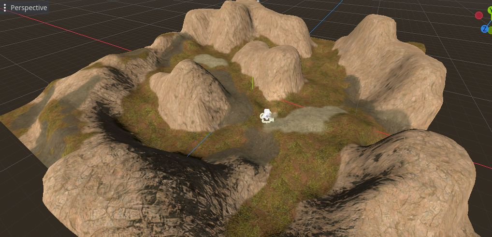

# Terrain Layered Shader

This project provides two shaders in Godot shading language for making large terrain textures.  These shaders use a tile scrambling algorithm to break up the repeating texture pattern.  You can also use masks to stack several textures on top of each other.

This archive also includes a Blender file with a similar shading network you can use for rendering in Blender.

## Installation

Download the archive and copy its code into your Godot project.  You only need to copy the code in the /godot/addons/terrain_layered_shader folder.  It must be placed in a folder named /addons/terrain_layered_shader in your Godot project.  There is no need to enable this addon, since it is only used to provide the shader resources.

## Usage

This addon provides two shaders - terrain_shader_base.tres which is the shader for the bottom of your terrain stack and terrain_shader_masked.tres which is used for every layer you stack on top of that base layer.  The shaders are chained together by using the Next Pass slot of the shader below them.  In this way, each next pass draws a new layer of terrain over top of all the shaders below it in the stack.

To begin, select your mesh and in the Inspector window open the Surface Material Override.  Click the dropdown and create a new ShaderMaterial.  Then drag the res://addons/terrain_layered_shader/shaders/terrain_shader_base.tres shader into this slot.  This will compile the shader and provide you with a lot of options to configure how it looks.  You can set diffuse, metallic, roughness and normal maps here.  This shader closely follows how Godot's StandardMaterial3D handles these parameters.  You will also find a Tile Margin slider here.  This determines the width of the blending region between two neighboring tiles.  Adjusting this will make the transition between tiles more or less sharp.

When you have your base layer set up, you can add your first layer by using a terrain mask.  In the Next Pass slot of your base shader, create a new ShaderMaterial and set its Shader to res://addons/terrain_layered_shader/shaders/terrain_shader_masked.tres.  This layer works similarly to the base layer, but also includes a Mask section.  When you open this, there is an area where you can set the mask that will be used to block out parts of your terrain.  

You will also need to set the Mask Channel.  This tells the shader program which of the mask layers to use.  (This is to allow users to pack several different masks into the same texture.)  So if you want to use the red channel of your mask texture, set the Red component of the Mask Channel to 1 and set the other sliders to 0.  If you want to use the green channel, set Green to 1 and everything else to 0.

The Mask Scale will multiply the value of the mask to make it more or less transparent.  You can use this to boost the power of a mask if it is not strong enough by default.

You can also adjust the masks' UV scale and offset here if you wish.

Once you're created your first layer, you can continue to create more layers by adding a new ShaderMaterial to the Next Pass parameter and setting it to be a terrain_shader_masked.tres.

You should never use the terrain_shader_masked.tres as the bottom most layer in your layer stack.  The terrain_shader_masked is considered to be transparent and so is drawn on the transparent pass.  This can cause strange artifacts when you render it.  Always use a terrain_shader_base as the first layer and place terrain_shader_masked for all subsequent layers.

## Support

If you found this software useful, please consider buying me a coffee on Kofi.  Every contribution helps me to make more software:

